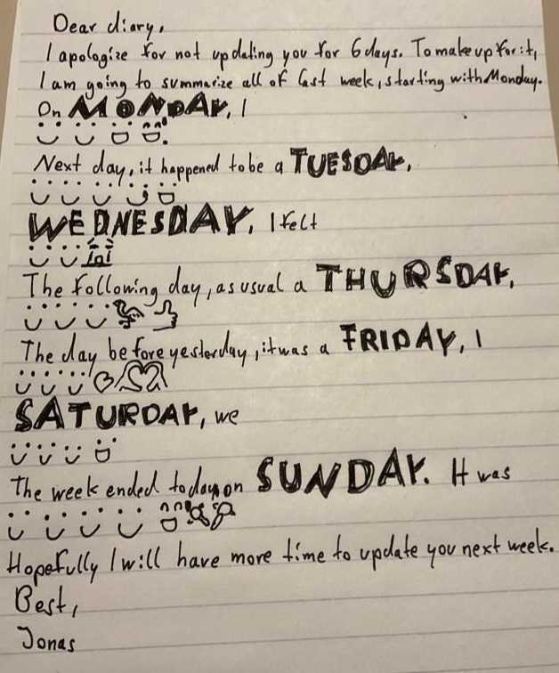

```{r setup, include=FALSE}
knitr::opts_chunk$set(echo = TRUE)
library(tidyverse)
library(ggplot2)
library(lubridate)
library(emo)
library(ggrepel)
library(ggtext)
library(knitr)
data <- read_csv("data/data.csv")
```

Throughout the "Dear (My) Data" assignment, I explored my emoji usage on WhatsApp over the course of one week. The task was to collect data pertaining to an aspect of our lives that, when aggegrated, could provide insights. Furthermore, we were tasked with generating both a physical and a digital visualization based on the collected data. In this report, I provide an account of this process, detailing the decisions I made and the thought processes behind them. I will begin by sharing the motivations behind my choice of data source and the methods I employed for data collection. Subsequently, I will detail the choices I made regarding the visualizations and the techniques I used to create them. Finally, I will discuss the outcomes and insights gained from this assignment.

## Data Source

 Instead of actively recording data, I wanted to use data already collected by the digital services I use, as I believed it would provide me with an understanding for the knowledge the providers of these services have about my live, sometimes in very personal areas. I considered using data from my Spotify listening history, contributions on GitHub, Google Maps Location History, and WhatsApp text messages. While this does not necessarily separate them from other companies that store digital traces for profit, the companies behind the enumerated services provide ways to access and download personal data. Spotify and GitHub have convenient APIs for this purpose. Google offers a graphical user interface to access data collected by its services, including Google Maps. WhatsApp stores text messages locally and, if enabled, in the cloud. While the data file is not designed for direct user access and requires a decryption key, WhatsApp does allow manual export of messages from individual chats. However, this method is time-consuming if you want to access all your data at once.

Despite these limitations, I decided to use WhatsApp data. In my opinion, this is the most revealing and potentially most insightful data I could collect out of the options I mentioned beforehand. While a location history is also very personal and uncovers much of a persons life, sometimes the context of a location is not clear and, in terms of generating insights, I already know that there is a pattern to my movements. WhatsApp data is even more personal. This platform has witnessed intimate conversations and interactions. I have had disagreements, offered condolences, organized social gatherings, confided in others about challenges in my life, and expressed affection for those close to me. The fact that all of this is potentially accessible to a company is worth exploring and reflecting on. 

One limitation of this data source is that it is unstructured text data. While chats can indeed contain sensible information, information can only be extracted from raw text by humans that would have to read the chats one at a time. To generate spreadheet-like data, text needs to be processed with predetermined goals. For this assignment, I wanted to find out if WhatsApp data could reveal something about my emotional state throughout the week. Emotional state in text messages is often intentionally revealed by using (or not using) emojis, so I simply counted which emojis I used for a week. This includes reactions to messages from other people. To count emojis, I systematically went through all my chats, starting from the first message on Monday, and recorded this data in a spreadsheet. Each day had its own row, and each emoji was represented as a column. Since emojis have various visual representations, I used standardized Unicode representations as column titles for consistency. When I created an emoji with punctuation, for example ":)", I counted them as the most equivalent standardized emoji. The final dataset is displayed in *Fig. 1* below.

```{r echo=FALSE}
kable(data, format = "markdown", digits = 2)
```
<p style="font-size:12px">*Fig. 1: WhatsApp Emoji Counts Dataset*</p>

While there are more sophisticated tools available for detecting emotions in text, I decided not to use them for several reasons. First, such methods appeared to be beyond the scope of this assignment. Second, given the personal nature of this data, it felt inappropriate to analyse it by utilizing automated algorithms. Some messages in these chats hold emotional significance for me and some I even avoid revisiting to prevent reliving the emotional states of their context. An example of the latter is my chat history with my grandmother who has passed away. The thought of storing them in a folder for anonymous programs to process into numerical representations of reduced meaning felt uncomfortable. Additionally, because of the fact that the raw data includes messages from other people, even though my analysis would have focused only on messages I wrote, it seemed both unfair and unsafe to process this data without their explicit permission.

## Digital Visualization

The recommended tool for this assignment was Datawrapper, but I made the choice to use ggplot instead. My reason for this decision was that I wanted to include the actual emojis in my plots and to create an overlap between a line plot and a scatter plot. Achieving this level of customization didn't seem feasible with Datawrapper. On the contrary, ggplot, being an R package, offers the flexibility to create highly customized visualizations by leveraging a grammar of graphics.

The motivation behind overlapping a line plot and a scatter plot was rooted in the data itself. Except for the smile emoji (U+1F642), all other emojis were used only once per day. This resulted in a kind of binary pattern that a standard line plot couldn't effectively convey. I did consider using a cross table, but I wanted a unified visualization that could accommodate all emojis. To create the scatterplot in this visualization, I had to reconfigure the columns containing all emojis, excluding the smile emoji, so that there was a column for emoji type and its corresponding count per day. The attempt at this visualization is depicted in Fig. 2.

```{r include=FALSE}
# simple data processing
## formatting date
emojis <- data %>%
  mutate(Date = dmy(Date))

## transpose part of dataset so that scatterplot is possible
emojis_transposed <- emojis %>% 
  pivot_longer(!Date, names_to = "emoji", values_to = "count")

## transform unicode notation so that eomjis are displayed 
emojis_transposed <- emojis_transposed %>%
  mutate(converted_emoji = sapply(emoji, function(cp) intToUtf8(as.integer(sub("U\\+", "0x", cp)))))

emojis_transposed_filt <- emojis_transposed %>%
  filter(emoji != "U+1F642")
```

```{r echo=FALSE, fig.fullwidth=TRUE}
emojis %>%
  # Add a new column called label
  mutate(label = if_else(Date == max(Date), as.character(emo::ji("blush")), NA_character_)) %>%
  
  # Create a ggplot object
  ggplot() +
  
  # Add a line to the plot
  geom_line(aes(x = Date, y = `U+1F642`, group = 1), na.rm = TRUE) +
  
  # Set the title and axis labels
  labs(x = "Day", y = "Count") +
  
  # Customize the y-axis
  scale_y_continuous(breaks = seq(1, 5), limits = c(0, 4.5)) +
  
  # Add text labels to the plot
  geom_text_repel(aes(x = Date, y = `U+1F642`, label = label), nudge_x = 0.2, nudge_y = 0.1, na.rm = TRUE, size = 5.5, segment.color = "transparent") +
  
  # Add points to the plot
  geom_point(data = emojis_transposed_filt, aes(x = Date, y = count), na.rm = TRUE) +
  
  # Add text labels to the plot
  geom_text_repel(data = emojis_transposed_filt, aes(x = Date, y = count, label = converted_emoji), segment.color = "transparent", na.rm = TRUE, size = 5.5) +
  
  # Customize the plot appearance
  theme(
    plot.margin = margin(0.5, 0.5, 0.5, 0.5, "cm"), 
    plot.title = ggtext::element_markdown(), 
    axis.title.y = element_text(size = 12, margin = margin(t = 0, r = 10, b = 0, l = 0)), 
    axis.title.x = element_text(size = 12, margin = margin(t = 10, r = 0, b = 0, l = 0))
  ) +
  
  # Display weekdays on the x-axis
  scale_x_date(date_breaks = "1 day", date_labels = "%a")
```
<br>
<p style="font-size:12 px">*Fig. 2: WhatsApp Emoji Counts*</p>

The initial visualization had its limitations, primarily shedding light on the increase in my usage of the smile emoji throughout the week. Given the diverse and sporadic use of other emojis, it proved challenging to draw meaningful insights from it. This prompted the need for a classification approach. I decided to categorize the emojis I used into "positive" and "negative" categories, attributing emojis like the smile emoji to the "positive" category and others like the crying emoji to the "negative" category. Additionally, I calculated the relative usage of emojis. This involved dividing the number of emojis in each category by the total number of emojis used. This normalization process helped prevent bias that might arise from a general fluctuation in emoji usage. The outcome of this analysis is illustrated in *Fig. 3*.

```{r include=FALSE}
# manually assigning the emojis to classes 
emojis_class = emojis_transposed %>% 
  mutate(class = case_when(
    emoji == "U+1F642" ~ "positive",
    emoji == "U+1F972" ~ "negative",
    emoji == "U+1F9A9" ~ "positive",
    emoji == "U+1F44D" ~ "positive",
    emoji == "U+1F603" ~ "positive",
    emoji == "U+2764" ~ "positive",
    emoji == "U+1F605" ~ "negative",
    emoji == "U+1FA87" ~ "positive",
    emoji == "U+1FAF6" ~ "positive",
    emoji == "U+1F62D" ~ "negative"
  )) 


emojis_class <- emojis_class %>%
  mutate(count = replace_na(count, 0))


# grouping by day and counting occurance of classes
emojis_class_count <- emojis_class %>% group_by(Date, class) %>% summarize(sum_count = sum(count))
  
# calculating realtive occurance
emojis_class_count <- emojis_class_count %>%
  group_by(Date) %>%
  mutate(relative_occurrence = sum_count / sum(sum_count))
```

```{r echo=FALSE, fig.fullwidth=TRUE}

emojis_class_count %>%
  ggplot() +
  geom_line(aes(x = Date, y = relative_occurrence, color = class, group = class), na.rm = TRUE) +
  labs(x = "Day", y = "Relative Occurance") +
  scale_y_continuous(limits = c(0, 1)) +
  theme(
    plot.margin = margin(0.5, 0.5, 0.5, 0.5, "cm"),
    plot.title = element_markdown(),
    axis.title.y = element_text(size = 12, margin = margin(t = 0, r = 10, b = 0, l = 0)),
    axis.title.x = element_text(size = 12, margin = margin(t = 10, r = 0, b = 0, l = 0))
  ) +
  scale_x_date(date_breaks = "1 day", date_labels = "%a")
```
<br>
<p style="font-size:12 px">*Fig. 3: Normalized Occurance of Classified WhatsApp Emojis*</p>

Given the relatively low number of emojis I used throughout the week, the potential for extracting insights may be limited. Despite that, if we assume that the classification into positive and negative emojis is valid, it appears that I tend to use more positive emojis than negative ones, and there is also a slight increase in the usage of positive emojis as the week progresses. If we assume that emoji usage reflects one's emotional state, it would imply that I should have felt better towards the end of the week. However, as I will reflect upon later, the reality was quite the opposite.

## Physical Visualization

For the physical visualization, I aimed to move beyond simply drawing a plot that I could also have created digitally. In addition, I wanted to take advantage of the nature of emojis, which are expressive symbols themselves. My primary objective was to gain insights into my emotional state, and to achieve this, I thought about how people typically convey their emotions in a physical, non-digital manner. The concept that emerged was akin to writing a diary entry but instead of using text, I would create a visual representation by drawing all the emojis I had used on that particular day. I envisioned this as resembling a stacked bar chart, with the emojis forming a diary-like text container. The resulting visualization is displayed in *Fig. 4*.



<br>
<p style="font-size:12 px">*Fig. 4: WhatsApp Emoji Diary Visualization*</p>
Unfortunately, due to my limited drawing abilities, the physical visualization didn't turn out as aesthetically pleasing as I had hoped. Drawing some of the more intricate emojis proved challenging given my skill level. However, in my view, the insights that can be derived from this visualization are similar to the ones from the initial digital attempt (Fig. 2). The usage of the smile emoji increases slightly over the week, while the usage of the other emojis is too fragmented to derive insights. For the physical visualization, the fact that I didn't use a large number of emojis worked to my advantage, making the task more manageable and the visualization less cluttered. 

## Discussion

In summary, my choice to use WhatsApp data was driven by the belief that this personal dataset held the potential for insights into my life. My aim was to gain a glimpse into my emotional state throughout the week by tracking emoji usage. Although the quantity of emojis used didn't facilitate a comprehensive analysis, one insight was the apparent improvement in my mood toward the week's end. However, my recollection of this week tells a different story.

During that week, I fell ill on Thursday, which led to my missing out on recreational activities. Instead, I found myself confined to my bed while the weather outside was sunny. Furthermore, a tragic event occurred over the weekend when Hamas carried out a massacre that claimed the lives of over a thousand people. I offered my condolences to Israeli friends over WhatsApp and was saddened by the state of the world and shocked by the inflicted harm. Both of these circumstances lead to a worse emotional state towards the end of the week and this was not reflected at all in the data I collected. 

I theorize multiple reasons for the limitations of this data. First, WhatsApp data, while covering a significant part of my life, is not all-encompassing. There are various means of communication, such as face-to-face conversations, phone calls, or other messaging platforms, which are not accounted for in this dataset. These omitted interactions could carry insights into my emotional state. However, I might even not communicate my emotional state at all.

Furthermore, it is important to acknowledge that using emojis as a sole indicator of emotional state has inherent limitations. The selection and use of emojis can sometimes be arbitrary or may not accurately reflect my true emotional state. There are occasions when I deliberately choose an emoji that does not align with my actual emotions, either for communication purposes or to convey a different sentiment. For instance, I might use a smiling emoji after sharing news of being sick to reassure someone that it's not a severe illness. Conversely, there are scenarios where using emojis feels inappropriate to me, such as when offering condolences, which results in a gap in the data regarding true emotional states.

To address these limitations and improve the interpretability of using emojis on their own, I attempted to classify them for the second digital visualization. For certain emojis, like the flamingo or the maracas, a binary emotional state classification is not evident. I use some emojis for their randomness as a form of humor, and even with context, their classification can be challenging. It is essential to recognize that emotional states are not binary; people don't have solely good or bad days. The reality is far more nuanced both emotionally and temporally. 

Based on these results and the fact that the data I collected is accessible to the service provider as well, the aspect of data privacy comes to mind. People generally object to strangers being aware of private events in their lifes. Given the misalignment between reality and data aggregation, one might draw the conclusion that despite the personal nature of WhatsApp data, the level of insights one can gain from it is limited. However, as I already mentioned, there are more sophisticated tools that can be used to extract insights from unstructured text data, for example using vector representations of meaning. There are tools to very accurately extract information from text using this as its basis. Also, I could have used a more finely grained measurement interval. 

Moreover, WhatsApp is owned by Meta, which also owns other services that people use concurrently. Combining data from Instagram and WhatsApp might reveal additional facets of a person's life. WhatsApp's status as a standard messenger for many individuals provides it with the potential to wield power over its users by potentially extracting knowledge, not only at an individual level but also on a larger, macro scale. This could potentially lead to insights into collective behavior, which poses further questions about data privacy and the impact of data aggregation on individuals and society as a whole.

In support of data privacy, WhatsApp asserts that messages on their platform are end-to-end encrypted. If this claim is true, it would mean that the service provider cannot extract insights from the messages. However, the encryption code is proprietary and cannot be independently verified, necessitating individuals to trust the company. The fact that users cannot not be sure of how their data is handled and the monopoly WhatsApp has on the messenger market also raises concerns over what happens when WhatsApp shares data with the state. Repressive governments might use messenger data to assert control over peoples lives, sanctioning undesired behaviour. There are alternative options for messengers and social media. It is important to note that if WhatsApp were open source, it would enable transparency and public verification. In an open-source scenario, anyone could verify claims regarding data privacy and data handling, enhancing trust and data protection. Furthermore, open-sourced communication protocols allow messenger platforms to be hosted in a decentralized manner, distributing the power over data and reducing the risk of centralized control and abuse.

It is worth mentioning that WhatsApp is a free-to-use platform, and its only apparent source of income is WhatsApp Business, where other companies pay Meta to utilize the platform for commercial purposes. While the exact financial details are not known to me, it is conceivable that this revenue source alone may not cover the costs of hosting a platform used by millions of people. This financial model leads to reservations about trusting the platform blindly, because as is known from examples such as Google, companies can profit from digital traces by selling insights from user data to external actors. 

This assignment prompted me to contemplate the implications of using a messenger platform that I have no control over to communicate personal and emotional aspects of my life. The process of collecting data made me aware of the significance of this data and raised questions about whether I should trust external capitalist or state actors to keep it safe. While my personal exploration did not yield significant insights about my life and it underscored the limitations of working with unstructured text data and classification, I believe that other entities may have the potential to succeed where I did not, which emphasizes the importance of data privacy and the need for individuals to remain vigilant about how their data is handled and shared.


 

